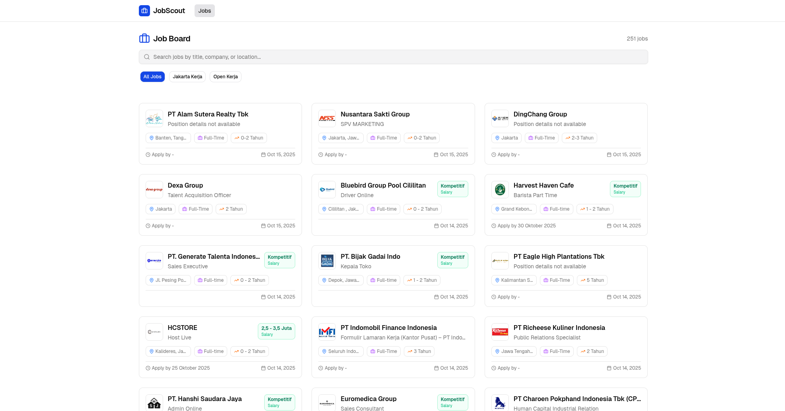
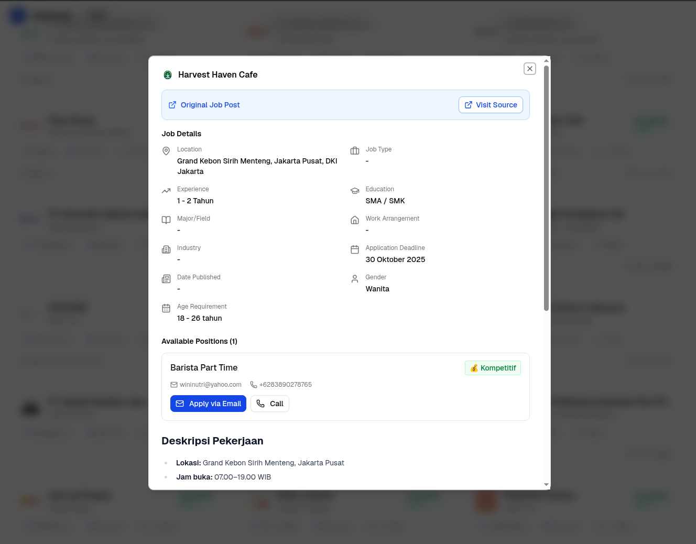

# 🕵️‍♂️ Job Scout

**Job Scout** is a full-stack **job aggregator and search platform** built with **FastAPI** (backend) and **Next.js** (
frontend).  
It automatically scrapes job postings from multiple job provider websites, stores them in a PostgreSQL database, and
provides a **searchable API** powered by **Full-Text Search (FTS)**.

---

## Screenshots

> Example UI previews of the app

| Homepage                             | Detail Job Dialog                         |
|--------------------------------------|-------------------------------------------|
|  |  |

---

## ✨ Features

### 🔧 Backend (FastAPI)

- 🔄 **Automated Background Sync** — Scrapes and updates job data from providers like *JakartaKerja* and *OpenKerja*
- 🕸️ **Async Scraping** — Built using `aiohttp` + `BeautifulSoup` for efficient non-blocking scraping
- 🧱 **SQLModel ORM** — Combines the power of SQLAlchemy and Pydantic
- 💾 **Duplicate-Safe Updates** — Avoids inserting the same job twice
- 🔍 **Full-Text Search (FTS)** —  
  Search jobs by title, company, or location using PostgreSQL’s FTS system
    - Works with both **Bahasa Indonesia** and **English** data
    - Uses `to_tsvector` + `plainto_tsquery` with `"simple"` dictionary
- 🧰 **Swagger UI** — Auto-generated API docs at `/docs`
- ⏰ **APScheduler Integration** — Automates scraping at scheduled times

---

### 💻 Frontend (Next.js + shadcn/ui)

- ⚡ **Next.js 15 App Router**
- 🧩 **@tanstack/react-query** for API state management & infinite scroll pagination
- 🎨 **TailwindCSS + shadcn/ui** for modern, accessible components
- 🔎 Integrated **Full-Text Search** UI
- 🧭 **Provider Tabs** (e.g. *All Jobs*, *JakartaKerja*, *OpenKerja*)
- 📱 Responsive design

---

## 🗂️ Tech Stack

| Layer        | Technology                                                            |
|--------------|-----------------------------------------------------------------------|
| **Frontend** | Next.js 14, TypeScript, TailwindCSS, shadcn/ui, @tanstack/react-query |
| **Backend**  | FastAPI, SQLModel, APScheduler, aiohttp, BeautifulSoup4               |
| **Database** | PostgreSQL (Full-Text Search enabled)                                 |
| **Server**   | Uvicorn (ASGI)                                                        |

---
